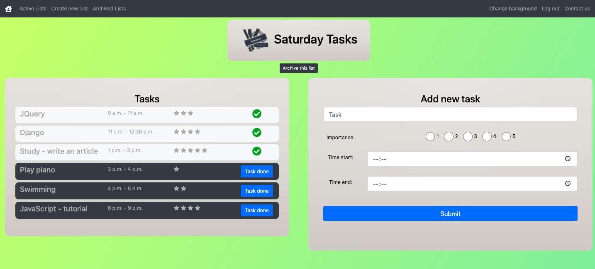

# ToDo Lists

## General info

This app allows you to create your own to-do lists. \
After creating a list you can add tasks and specify their importance. \
You can archive lists and reactivate them, if you need to use them one more time. 


## Table of contents
* [Screenshots](#screenshots)
* [Setup](#setup)
* [Usage](#usage)
* [Owner](#owner)
* [License](#license)

## Create your own ToDo-Lists


### Edit ToDo-Lists and add new tasks


### Personalize your app


## Setup
### Clone the source:

```shell
$ git https://github.com/milenakowalska/todolist
$ cd todolist
```
### Install packages

```shell
$ pip3 install -r requirements.txt
```
### Run and open the app

Run the code in terminal:

```shell
$ python3 manage.py runserver
```

According to the displayed information: "Starting development server at http://127.0.0.1:8000/",  \
open the app in browser using the link http://127.0.0.1:8000/

## Usage

First you need to create your account using the "Register" option. \
When you log in, you can create your own ToDo-List by clicking on "Create new List". \
Put a list name and press the "Save" button. \
You will be automatically forwarded to the "Active Lists" section, where you can see your lists and choose the one that you want to work with. \
Each list page gives you the possibility to add new task, by specifying its name, importance and time range. \
Tasks are displayed on the left side. If you complete them, press the "Task done" button. \
\
Each list page has its "Archive List" button. \
If you click on it, the list will be moved to "Archived Lists" section. \
\
The app allows you to change the background design. In order to do this, click the button "Change background" in the sidebar. \


## Owner
Created by milenakowalska.

## License
[](http://badges.mit-license.org)

- **[MIT license](http://opensource.org/licenses/mit-license.php)**
